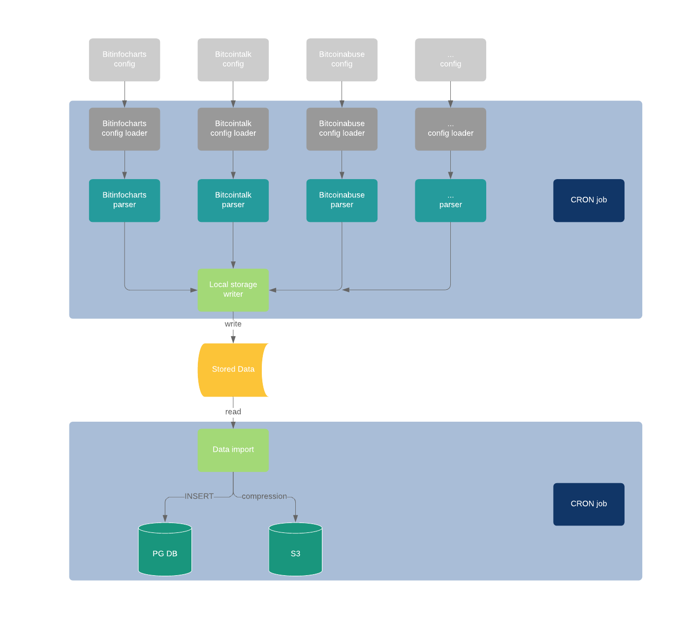

# Crypto parser

Cryptocurrency address parser made in PHP - Laravel.

Author: Vladislav Bambuch - xbambu03@stud.fit.vutbr.cz

## Run project
Prepare DB tables:
```bash
  php artisan migrate --force 
```
Insert categories into the DB:
```bash
  php artisan db:seed --force
```
Run the project script:
```bash
  php artisan [specific web parser] [1|2|3] #optional verbose argument (default=1)
```


## Architecture



## TODO
* Retry failed requests.
* Calculate `maxPage` automatically from DOM difference.
* Add more cryptocurrencies from the web.
                 